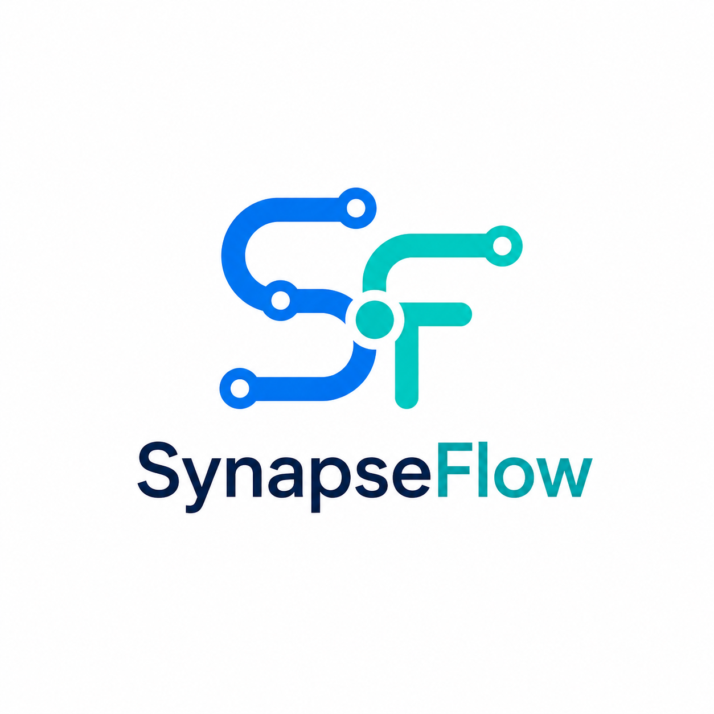

<p align="center">
  
</p>
<h1 align="center">
  Synapse DTC Starter
</h1>

<h4 align="center">
  <a href="https://docs.medusajs.com">Documentation</a>
</h4>

<p align="center">
  Building blocks for digital commerce powered by Synapse
</p>

<p align="center">
  <a href="LICENSE">
    
  </a>
</p>

# Synapse DTC Starter

A production-ready monorepo starter for direct-to-consumer ecommerce stores powered by Synapse and Next.js. Includes a fully featured storefront with product browsing, cart, checkout, customer accounts, and order management.

## Features

- All of Synapse's commerce features
- Multi-region support with automatic country detection
- Product catalog with variant selection
- Cart with promotion codes
- Multi-step checkout with shipping and payment
- Customer accounts with order history and address management
- Order transfer between accounts

## Getting Started

### Local Installation

> **Prerequisites:**
>
> - [Node.js](https://nodejs.org/) v20+
> - [PostgreSQL](https://www.postgresql.org/) v15+
> - [pnpm](https://pnpm.io/) v10+

1. Clone the repository and install dependencies:

```bash
git clone https://github.com/levanduy093-work/agentic-retail-ops.git
cd agentic-retail-ops
pnpm install
```

2. Set up environment variables for the backend:

```bash
cp apps/backend/.env.template apps/backend/.env
```

3. Set the database URL in `apps/backend/.env`:

```bash
# Replace with actual database URL, make sure the database exists.
DATABASE_URL=postgres://postgres:@localhost:5432/synapse-dtc-starter
```

4. Run migrations:

```bash
cd apps/backend
pnpm medusa db:migrate
```

5. Add admin user:

```bash
cd apps/backend
pnpm medusa user -e admin@test.com -p supersecret
```

6. Start Synapse backend:

```bash
cd apps/backend
pnpm dev
```

7. Open the admin dashboard at `localhost:9000/app` and log in. Retrieve your publishable API key at Settings > Publishable API key.

8. Set up environment variables for the storefront:

```bash
cp apps/storefront/.env.template apps/storefront/.env.local
```

9. Update `apps/storefront/.env.local` with your Synapse publishable API key:

```bash
NEXT_PUBLIC_MEDUSA_PUBLISHABLE_KEY=pk_6c3...
```

10. Start storefront:

```bash
cd apps/storefront
pnpm dev
```

The storefront runs on `http://localhost:8000`.

You can also run the following command from the root to start both backend and storefront:

```bash
pnpm dev
```

## Configuration

The storefront is configured via environment variables in `apps/storefront/.env.local`:

| Variable | Description | Default |
|----------|-------------|---------|
| `NEXT_PUBLIC_MEDUSA_PUBLISHABLE_KEY` | Publishable API key from your Synapse backend | — |
| `NEXT_PUBLIC_MEDUSA_BACKEND_URL` | URL of your Synapse backend | `http://localhost:9000` |
| `NEXT_PUBLIC_DEFAULT_REGION` | Default region country code | `dk` |
| `NEXT_PUBLIC_BASE_URL` | Base URL of the storefront | `https://localhost:8000` |
| `NEXT_PUBLIC_STRIPE_KEY` | Stripe publishable key (optional) | — |

## Resources

- [Synapse Architecture & Docs](https://docs.medusajs.com)

## Agent platform development

Trước khi xây hoặc sửa agent, đọc theo thứ tự:

1. [`AGENTS.md`](./AGENTS.md);
2. [`docs/session-logs/2026-08-10-agent-platform-foundation-handoff.md`](./docs/session-logs/2026-08-10-agent-platform-foundation-handoff.md);
3. [`AGENT_CATALOG.md`](./AGENT_CATALOG.md);
4. [`AGENT_FOUNDATION.md`](./AGENT_FOUNDATION.md).

Session handoff ghi source map, kiến trúc control plane, lệnh bootstrap/test và
ranh giới giữa nền đã code với deployment gate còn thiếu.
